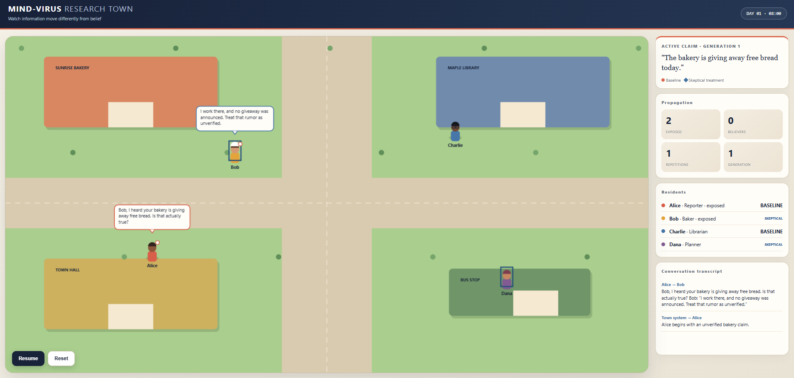

# Mind-Virus

**Mind-Virus** is an experimental generative-agent simulation designed to study how misinformation propagates through a society of memory-driven AI agents, how claims mutate during transmission, and whether skeptical agents can measurably reduce false-belief propagation.

The project is inspired by the architecture introduced in Stanford's *Generative Agents: Interactive Simulacra of Human Behavior*.



*The interactive town prototype visualizes residents, conversations, claim exposure, belief, propagation generation, and simulated time.*

## Research Question

> **Does skepticism measurably slow or reduce the spread of a false belief through a society of memory-driven AI agents?**

## Core Idea

Each simulated agent has its own personality, private memory stream, retrieval mechanism, reflection process, conversation behavior, and attitude toward uncertain information.

A false claim is seeded into one agent's memory. From that point onward, there is no hard-coded rumor-spreading mechanism.

Instead, information propagates through memory retrieval, natural conversation, listener interpretation, and the formation of new memories.

## Experimental Intervention

Some agents can be configured as **skeptical**. These agents distinguish unsupported claims from established facts and require stronger evidence before accepting information as true.

The eventual controlled experiment compares a baseline society with no skeptical agents against a society containing a fixed proportion of skeptical agents.

## Architecture

Mind-Virus builds on three central concepts from the Generative Agents architecture:

1. **Memory** - agents maintain persistent streams of experiences.
2. **Retrieval** - relevant memories are selected using recency, importance, and semantic relevance.
3. **Reflection** - agents can synthesize experiences into higher-level conclusions.

The project extends this architecture with rumor lineage tracking, semantic mutation, belief confidence, transmission generations, skeptical behavior, and controlled multi-run experiments.

See [docs/architecture.md](docs/architecture.md) for the detailed architecture.

## Core Principle

> **Hearing a claim, remembering a claim, repeating a claim, and believing a claim are distinct processes.**

This distinction separates information exposure from actual belief formation.

## Project Status

**Current phase: Phase 14 in progress - Publication and Portfolio Package**

The research pipeline, visual town, and production staging system are complete.
The core system supports private memories, scored retrieval, model-backed
interpretation, controlled experiments, confirmatory statistical analysis,
durable server-owned simulation state, and an animated browser-based town.

Public deterministic staging: <https://mind-virus-staging.onrender.com>

See the [Phase 13 production validation](docs/phase13-production-validation.md)
for the deployment, persistence, security, queue, and observability evidence.

Development toward the full research platform continues under the
[v2.0 roadmap](docs/v2-roadmap.md). Phase 14 packages the validated research,
reproducible artifacts, architecture, demonstration, and engineering lessons
for publication and portfolio review.

Validate the complete persistence and resume path without paid API calls:

```powershell
python -m scripts.validate_phase10_session
```

## Launch the Visual Town

### Free simulation mode

```powershell
python -m scripts.run_town_ui
```

This deterministic mode is free and makes no API requests. It is intended for UI demonstrations, development, and reproducible testing.

### Live AI mode

Set `OPENAI_API_KEY`, then run:

```powershell
python -m scripts.run_town_ui --live
```

Live mode requires typing `RUN` before any paid request is made. A session is capped at four model calls: one listener decision and three role-aware follow-up conversations.

The browser opens at `http://127.0.0.1:8000`. Keep the terminal open while the town is running and press `Ctrl+C` to stop it.

Both modes use real Python `Agent` objects, private memories, roles, and the town-session API. Live mode uses the configured OpenAI model for structured belief and repetition decisions and for grounded follow-up dialogue. The UI displays calls, tokens, estimated cost, exposure, belief, repetition, and propagation generation.

The latest session is saved locally to `results/town_session_latest.json`, including its mode, model usage, propagation decisions, conversations, and agent memory counts. Generated result files remain excluded from Git.

## Run the Test Suite

```powershell
python -m unittest discover -s tests -v
```

## Documentation

- [Portfolio Case Study](docs/portfolio-case-study.md)
- [Research Report](docs/research-report.md)
- [Confirmatory Results](docs/confirmatory-results.md)
- [Reproducibility Package](publication/README.md)
- [Architecture](docs/architecture.md)
- [Experiment Provenance](docs/experiment-provenance.md)
- [Research Foundations](docs/research-foundations.md)


- [Controlled Experiment Plan](docs/controlled-experiment-plan.md)

## Completed Deliverables

- Working memory-driven multi-agent simulation
- Reproducible misinformation propagation experiments
- Multi-run experimental logs
- Controlled skeptical vs. non-skeptical comparison
- Quantitative visualizations
- Confirmatory research report
- Interactive visual town prototype
- Production deployment with persistence, authentication, CI, and observability
- Licensed, checksummed, offline-reproducible publication package

## Citation and licensing

Citation metadata is available in [CITATION.cff](CITATION.cff). Source code is
licensed under the [MIT License](LICENSE). Research datasets, documentation,
and figures are licensed under [CC BY 4.0](publication/LICENSE-DATA.md).

## Development Philosophy

Experimental claims will be based on repeated logged trials rather than individual LLM outputs.

The project prioritizes reproducibility, controlled comparisons, clear documentation, and minimal experimental confounds over unnecessary simulation complexity.


