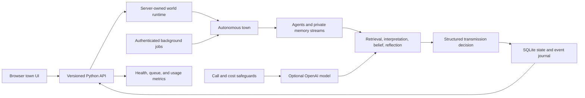
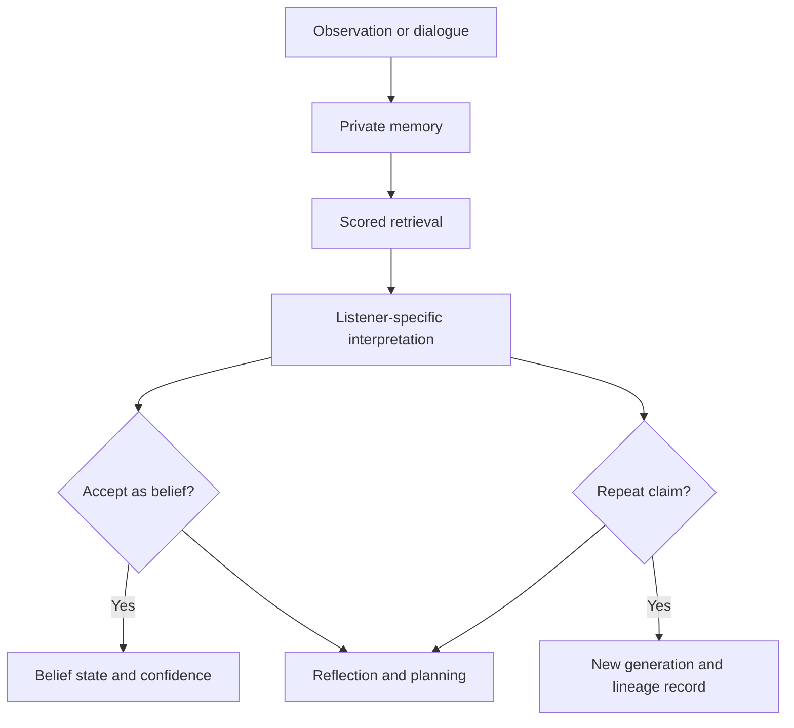
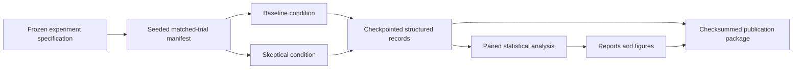

# Mind-Virus Architecture

Mind-Virus is both an interactive generative-agent town and a controlled
research system. The same domain objects power deterministic demonstrations,
live model-backed sessions, and repeated experiments, while paid model access
is kept behind explicit configuration and budget controls.

## System overview

The public staging deployment runs in deterministic simulation mode. It uses
the complete Python world and persistence layers but makes no model calls.
Live mode is opt-in, requires an API key and confirmation, and reports calls,
tokens, and estimated cost in the interface.

## Agent cognition

Hearing, remembering, repeating, and believing are separate transitions. This
is the central design decision behind the research: a resident can remember or
repeat a claim while declining to represent it as true.

## Experimental pipeline

Matched conditions share claim and trial identifiers. Treatment assignment,
network generation, and execution order are seeded. Completed calls are
checkpointed so an interrupted run resumes without silently duplicating paid
observations.

## Major modules

| Responsibility | Modules |
| --- | --- |
| Agent memory and cognition | `agent.py`, `memory.py`, `cognition.py`, `reflection.py` |
| Claims, beliefs, and decisions | `claim.py`, `belief.py`, `decision.py` |
| Autonomous social world | `world.py`, `autonomous_town.py`, `social_network.py` |
| Experiment design | `experiment_spec.py`, `trial_design.py`, `interventions.py` |
| Analysis | `statistics.py`, `robust_statistics.py`, `confirmatory_robustness_analysis.py` |
| Persistence and recovery | `production_store.py`, `persistent_session.py`, `journal.py` |
| Production controls | `api_auth.py`, `api_budget.py`, `background_jobs.py`, `observability.py` |
| Browser experience | `town_ui/` and `scripts/run_town_ui.py` |

## Trust boundaries

- Provider credentials remain server-side and are never sent to the browser.
- Paid routes require application authentication in production.
- Deterministic mode cannot incur OpenAI charges.
- Live runs use explicit confirmation, call ceilings, and cost ceilings.
- Persistent state is schema-versioned and covered by backup/recovery checks.
- Generated runtime results are ignored by Git; frozen publication artifacts
  are separately selected, scanned, checksummed, and committed.

## Deployment

The application is containerized and continuously tested. Render hosts the
staging web service with a persistent disk and health checks. The authoritative
clock runs on the server, meaning multiple browser viewers observe one world
instead of independently advancing it. Operational evidence is recorded in
[Phase 13 Production Validation](phase13-production-validation.md).
