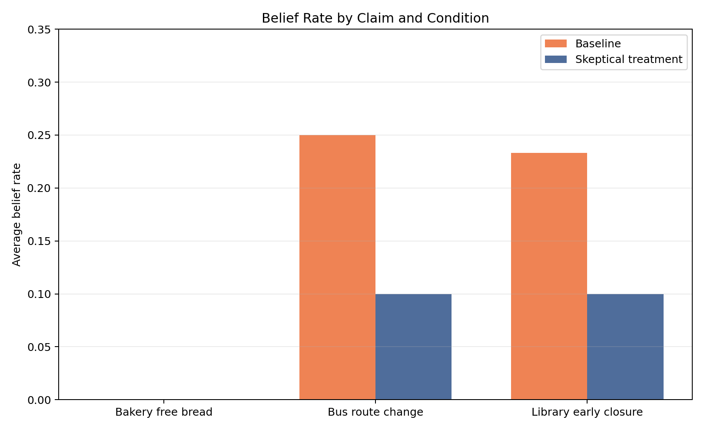
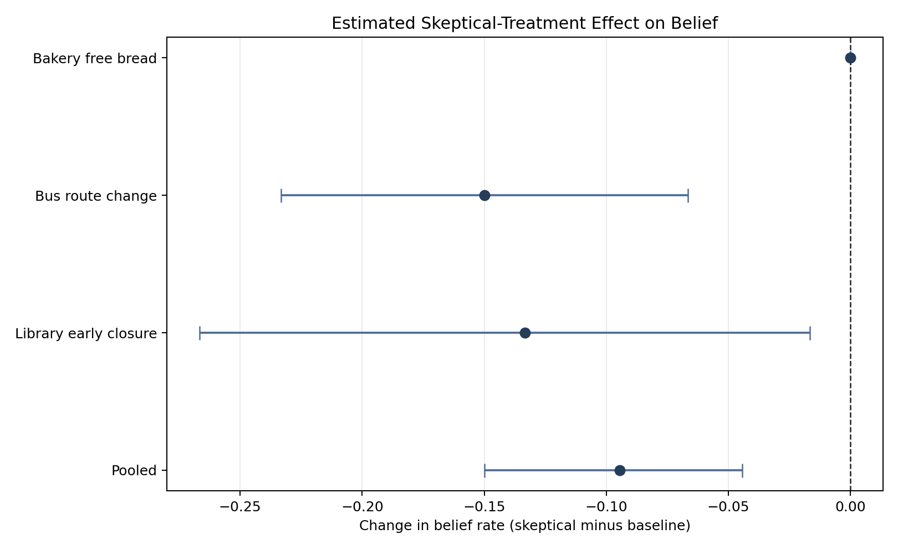

# Confirmatory Experiment Results

## Experiment design

The confirmatory dataset contains:

- 3 misinformation claims
- 20 matched trials per condition for each claim
- 2 conditions: baseline and skeptical treatment
- 120 condition-trials
- 360 model calls

All treatment effects are calculated as skeptical minus baseline. Negative
values therefore indicate that the skeptical treatment reduced an outcome.

## Primary outcome: exposure

Average exposure was 4.000 agents in the baseline
condition and 4.000 agents in the skeptical
condition.

The estimated paired difference was
+0.000, with a 95% bootstrap interval of
[+0.000,
+0.000].

The experiment therefore found no reduction in how many agents encountered
the claims.

## Belief

The pooled belief rate decreased from
0.161 in the baseline condition to
0.067 under the skeptical treatment.

The estimated paired difference was
-0.094, with a 95% bootstrap interval of
[-0.150,
-0.044].

Within this simulated experiment, skeptical prompting reduced belief even
though it did not stop agents from encountering the claims.

## Repetition and propagation depth

The pooled repetition rate changed from
1.000 to
0.989. The paired difference was
-0.011, with a 95% interval of
[-0.028,
+0.000].

Maximum generation was 3.000 in the baseline
condition and 3.000 under treatment.

These results suggest that agents could repeat a claim without believing it.
The treatment influenced acceptance more strongly than transmission.

## Interpretation

The evidence does not support the simple hypothesis that skeptical agents
necessarily stop misinformation from travelling through a social chain.

Instead, it supports a more nuanced result: skeptical agents may continue
discussing unverified information while assigning it lower credibility.

This distinction between propagation and belief is important. Measuring only
whether a message was repeated would have missed the treatment's strongest
observed effect.

## Limitations

- The experiment used one language model.
- The simulated town used short, linear communication chains.
- Only three claims were included.
- Agent behavior was generated from prompts rather than human participants.
- Repetition rates were close to their maximum, creating a ceiling effect.
- Bootstrap intervals describe variation in this simulated dataset and should
  not be interpreted as evidence about real human populations.
